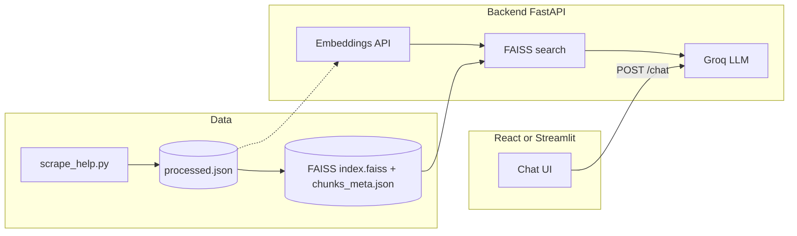

# Duolingo-inspired help RAG chatbot (demo)

Independent educational project: a **Retrieval-Augmented Generation (RAG)** chatbot that answers questions using **publicly visible** help content from [Duolingo’s Help Center](https://www.duolingo.com/help). This project is **not affiliated with Duolingo**.

## Architecture



1. **Phase 1 — Scraping:** Curated URLs from `data/urls.json` (or built-in defaults) are scraped one by one—**standard pages** use Playwright **`inner_text()`** on `main` / `article` / `[role="main"]` (with `#root`/`body` fallbacks and nav/footer stripped in-page); **`/help`** uses Playwright to expand each FAQ, wait for answer text, then read visible text. Output is chunked to ~300–500 tokens (`tiktoken`) into `data/processed.json` as `{ title, content, url }` rows.
2. **Phase 2 — Embeddings & FAISS:** **sentence-transformers** (`all-MiniLM-L6-v2` by default) runs locally; vectors are L2-normalized for **FAISS** `IndexFlatIP` (cosine via inner product).
3. **Phase 3 — RAG:** Embed the user query → retrieve top-k chunks → **Groq** chat completion with a prompt that enforces summarization and no verbatim copying.
4. **Phase 4 — Frontend:** Vite + React chat UI, or **Streamlit** (`streamlit_app.py`) talking to the same API; optional source links from retrieval metadata.

## Data Sources

This chatbot is built from **only a curated set of publicly available pages** published by Duolingo (and related official properties). It **does not crawl or scrape the entire Duolingo website**—URLs are fixed in `data/urls.json` and enforced by an allowlist in code (`scripts/scrape/allowlist.py`).

This repository is an **independent educational demo** and is **not affiliated with, endorsed by, or sponsored by Duolingo**.

### Pages used for scraping

The following URLs are the sole sources ingested into `data/processed.json`:

- https://www.duolingo.com/info
- https://www.duolingo.com/approach
- https://www.duolingo.com/efficacy
- https://blog.duolingo.com/handbook/
- https://design.duolingo.com
- https://www.duolingo.com/help

### Help center (FAQ) behavior

The page [https://www.duolingo.com/help](https://www.duolingo.com/help) is a dynamic interface: help topics appear as **expandable questions and answers**. The scraper uses **Playwright** to load the page, **programmatically expand each FAQ item** (reload per question, scroll-into-view + click, wait until answer text appears), and extract the question and answer text for indexing. Other URLs use **visible text** from the main content region, with navigation/footer nodes removed before reading text.

## Folder structure

```
project/
├── requirements.txt             # Streamlit Cloud + minimal Streamlit local deps
├── backend/
│   ├── app/
│   │   ├── main.py              # FastAPI app, CORS, lifespan
│   │   ├── config.py            # env settings
│   │   ├── schemas.py           # request/response models
│   │   ├── routes/chat.py       # POST /chat
│   │   └── services/
│   │       ├── embeddings.py    # sentence-transformers (local)
│   │       ├── retrieval.py     # FAISS load + search
│   │       ├── rag.py           # Groq prompt + completion
│   │       └── chat_log.py      # JSONL transcript logging
│   └── requirements.txt
├── streamlit_app.py             # Streamlit UI (optional)
├── .streamlit/config.toml       # Streamlit theme / server defaults
├── frontend/                    # Vite + React
│   ├── src/App.jsx
│   └── ...
├── data/
│   ├── urls.json                # curated targets + page kind (standard | help_faq)
│   ├── processed.example.json   # schema sample (git)
│   ├── processed.json           # generated — gitignored
│   ├── index.faiss              # generated — gitignored
│   ├── chunks_meta.json         # generated — gitignored
│   └── chat_log.jsonl           # chat transcripts — gitignored
└── scripts/
    ├── scrape_help.py           # Phase 1 CLI (adds scripts/ to PYTHONPATH)
    ├── scrape/                  # scraper modules (allowlist, URLs, standard, FAQ, chunking)
    └── build_index.py           # Phase 2 (reads content/url or legacy text/source_url)
```

## Prerequisites

- Python **3.10+** recommended (3.9 may work).
- Node **18+** if you use the Vite React frontend (optional if you only use Streamlit).
- API key: **Groq** for chat ([console](https://console.groq.com/)). Embeddings use a **local** model (no embedding API).
- **Playwright** browser (installed via `playwright install chromium` after pip install).

## Setup and run locally

### 1. Clone and environment

```bash
cd "AI-powered-language-learning-chatbot-inspired-by-Duolingo"
cp .env.example .env
# Edit .env: GROQ_API_KEY (embeddings are local; no OpenAI key)
```

### 2. Python backend

```bash
python3 -m venv .venv
source .venv/bin/activate   # Windows: .venv\Scripts\activate
pip install -r backend/requirements.txt
python -m playwright install chromium
```

### 3. Build the knowledge base

```bash
# Phase 1 — scrape curated URLs (several minutes; /help reloads per FAQ)
python scripts/scrape_help.py
# Optional: custom list (must stay within the repo allowlist in scripts/scrape/allowlist.py)
# python scripts/scrape_help.py --urls path/to/urls.json

# Phase 2 — embeddings + FAISS (local sentence-transformers; first run may download the model)
python scripts/build_index.py
```

Dry run (no network; writes `processed.json` with **empty** `chunks` — use only to check paths):

```bash
python scripts/scrape_help.py --dry-sample
```

To build an index you need real chunks from a full scrape (`python scripts/build_index.py` after `scrape_help.py` without `--dry-sample`).

### 4. Start the API

From the **`backend`** directory:

```bash
cd backend
uvicorn app.main:app --reload --host 0.0.0.0 --port 8000
```

Check `GET http://127.0.0.1:8000/health` — `index_loaded` should be `true` after building the index.

### 5. Start the frontend

```bash
cd frontend
npm install
npm run dev
```

Open the printed URL (default `http://localhost:5173`). The Vite dev server proxies `/chat` and `/health` to port **8000**.

To point the UI at another API base URL:

```bash
VITE_API_BASE=http://127.0.0.1:8000 npm run dev
```

### 6. Streamlit UI (alternative)

With the **same** FastAPI server running on port **8000**, from the **repository root**:

```bash
# venv active — root file is enough for Streamlit only; use backend/requirements.txt for the full stack
pip install -r requirements.txt
streamlit run streamlit_app.py
```

Opens **http://localhost:8501** by default. Sidebar: set **RAG API base URL** or export `RAG_API_BASE` (e.g. `http://127.0.0.1:8000`). Uses `httpx` server-side — no CORS setup needed for Streamlit.

**Streamlit Community Cloud:** The repo includes a root **`requirements.txt`** so Cloud can install `streamlit`, `httpx`, and `python-dotenv`. Set **Main file path** to `streamlit_app.py` and add **`RAG_API_BASE`** in app secrets to your deployed FastAPI URL (the API must be reachable from the internet).

## Configuration

| Variable | Purpose |
|----------|---------|
| `GROQ_API_KEY` | Chat completions |
| `SENTENCE_TRANSFORMER_MODEL` | Default: `all-MiniLM-L6-v2` (local embeddings) |
| `GROQ_MODEL` | Default: `llama-3.3-70b-versatile` |
| `TOP_K_RETRIEVAL` | Default: `5` retrieved chunks |
| `CHAT_LOG_ENABLED` | Default: `true` — append each chat turn to a file |
| `CHAT_LOG_PATH` | Filename under `data/` — default: `chat_log.jsonl` |
| `RAG_API_BASE` | Streamlit → API root; default `http://127.0.0.1:8000` |

### Chat transcript logging

Each `/chat` request is appended as **one JSON object per line** (JSON Lines) to `data/chat_log.jsonl` (configurable). Successful turns include `id`, `timestamp` (UTC ISO-8601), `query`, `answer`, and `sources`. Failed turns include `query` and `error` instead of an answer. Logging errors never block the API response.

Treat this file as potentially sensitive; it is **gitignored** by default. For multiple server processes or heavy concurrency, consider moving to a proper database (e.g. SQLite or Postgres) and a single writer.

## Notes

- **Embeddings & index:** Changing `SENTENCE_TRANSFORMER_MODEL` or switching embedding backends requires rebuilding the FAISS index (`python scripts/build_index.py`) so vector dimension and geometry match.
- **Scraping:** `www.duolingo.com/help` is a single-page app; the script uses **Playwright** for rendering, clicks, and visible-text extraction. Only public, no-login content is targeted.
- **Responses:** The system prompt instructs the model to **summarize and paraphrase** and to say when uncertain; this demo does not replace official Duolingo support.
- **Deployment** steps are intentionally omitted per project requirements.

## License

See [LICENSE](LICENSE).
